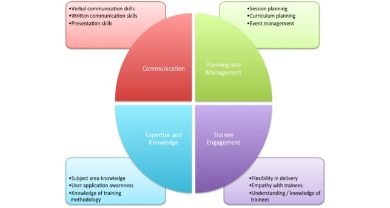
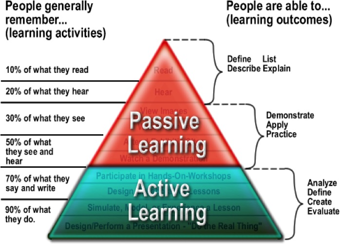

#ELIXIR – EXCELERATE Train-the Trainer subtask

## Session 2: Training techniques that can be used to enhance learner engagement and participation

 * Delivering a learning event as a mission; establishing learning mode, teamwork and mutual trust;
 * Teaching as a preformance art: promoting learner engagement;
 * The GOBLET skills matrix for trainers;
 * Motivation and demotivation;
 * Closed loop learning delivery;
 * Learning by doing;
 * Retention;
 * Priming; 
 * Self-confidence and usage independence;
 * Carpentry teaching practices (http://swcarpentry.github.io/instructor-training/15-practices/);
 * The role of wrap-up sessions;

####Delivering a learning event as a mission; establishing learning mode, teamwork and mutual trust
Start with learning objectives (LOs). Once you have defined what learners need to achieve, let LOs to lead the process.
The class space influences behaviours. The space in the training room can help to redefine how you implement LOs throughout the course.
Try to challenge yourself from more traditional, passive and instructor-led methods of teaching to more learner-centric methods that empower learners to be more engaged and involved in the process of skill development, mastery and application.
How can you use classroom space to turn challenges into opportunities for learning?
 
While a lecture or presentation mode can be used to kick-start a session, it can easily be followed by directing students to move to a different learning mode, to access content, their peers and the instructors to support learning. This dynamic interface stimulates both participants and instructors. 

Small groups, team-based exercises, and collaborative endeavours support a variety of learning modes.
Make sure to use clear and well developed protcolos that minimise any loss of time or productivity.
You can leverage multiple learning/teaching modes; indeed, fostering a high order of thinking skills is far more successful when students are given multiples ways to process information.  The variety of tools, twist of place to work and a range of people to network with at various intervals empower individuals.

Provide students easier access to you (the instructor)

####Teaching as a preformance art: promoting learner engagement

####The GOBLET skills matrix for trainers

####Motivation and demotivation

####Closed loop learning delivery

####Learning by doing

####Retention

####Priming
 
####Self-confidence and usage independence

####Carpentry teaching practices (http://swcarpentry.github.io/instructor-training/15-practices/)

####The role of wrap-up sessions

